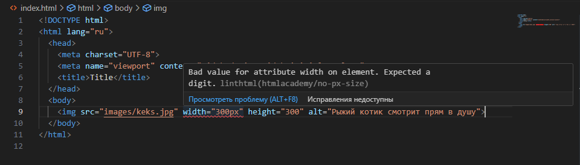

<div align="center">
    
</div>

# linthtml-config-htmlacademy
> Это стандартный конфигурационный файл для linthtml от [HTML Academy](https://htmlacademy.ru/).

## Установка

```bash
npm install @linthtml/linthtml linthtml-config-htmlacademy -D
```

## Использование

Когда вы установили `linthtml-config-htmlacademy` локально в свой проект, примените его в конфигурационном файле `.linthtmlrc` вашего проекта:

```json
{
  "extends": "linthtml-config-htmlacademy"
}
```

### Расширение конфига

Просто добавьте ключ `"rules"` в ваш конфиг после `"extends": "linthtml-config-htmlacademy"`, а затем добавьте туда свои правила.

Например, если вы хотите изменить максимальную длину `line-max-len`, то нужно:

```json
{
  "extends": "linthtml-config-htmlacademy",
  "rules": {
    "line-max-len": [
      true,
      120
    ]
  }
}
```

## Правила
Для проекта добавляются кастомные правила от [HTML Academy](https://htmlacademy.ru/), которые лежат в отдельном репозитории [linthtml-rules-htmlacademy](https://github.com/htmlacademy/linthtml-rules-htmlacademy).

## Использование в VS Code
Чтобы VS Code начал подсвечивать ошибки в HTML-разметке, установите плагин [LintHTML](https://marketplace.visualstudio.com/items?itemName=kamikillerto.vscode-linthtml).

> Обязательно убедитесь, что файл настроек называется `.linthtmlrc`, так как это обязательное [требование плагина](https://marketplace.visualstudio.com/items?itemName=kamikillerto.vscode-linthtml#:~:text=If%20you%20have%20a%20valid%20hmllint%20configuration%20file).



## npm и cli
Linthtml можно запускать в терминале. Для этого можно в секцию `"script"` в `package.json` добавить команду:
```bash
# package.json
"script" {
  "lint:html": "linthtml source/*.html --config .linthtmlrc"
}
```

- `linthtml` - запустит проверку HTML-файлов.
- `source/*.html` - поиск HTML-файлов в папке `source`. 
- `--config .linthtmlrc` - путь до конфигурационного файла. В проекте можно иметь несколько конфигурационных файлов.
