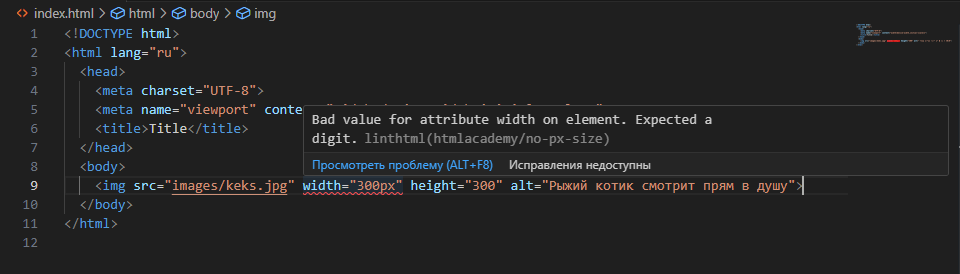

# LintHTML Config for HTML Academy Codeguide

[](https://www.npmjs.com/package/linthtml-config-htmlacademy)
[](https://github.com/htmlacademy/linthtml-config-htmlacademy/actions/workflows/test.yml)
[](https://github.com/htmlacademy/linthtml-config-htmlacademy/blob/main/LICENSE)

[LintHTML](https://linthtml.vercel.app) configuration for HTML markup validation according to [HTML Academy Codeguide](https://codeguide.academy).

## Requirements

- Node.js >= 24
- @linthtml/linthtml >= 0.10.0

## Installation

```bash
npm install -D @linthtml/linthtml linthtml-config-htmlacademy
```

## Usage

Create a `.linthtmlrc` configuration file in your project root:

```json
{
  "extends": "linthtml-config-htmlacademy"
}
```

### Extending the Config

Add a `rules` key after `extends` to customize rules:

```json
{
  "extends": "linthtml-config-htmlacademy",
  "rules": {
    "line-max-len": [true, 120]
  }
}
```

## Rules

This config includes custom rules from [linthtml-rules-htmlacademy](https://github.com/htmlacademy/linthtml-rules-htmlacademy). See the full [list of rules](https://github.com/htmlacademy/linthtml-rules-htmlacademy#rules).

## VS Code Integration

Install the [LintHTML extension](https://marketplace.visualstudio.com/items?itemName=kamikillerto.vscode-linthtml) to see errors highlighted in VS Code.

> The configuration file must be named `.linthtmlrc` as [required by the extension](https://marketplace.visualstudio.com/items?itemName=kamikillerto.vscode-linthtml#:~:text=If%20you%20have%20a%20valid%20hmllint%20configuration%20file).



## CLI Usage

Add a script to your `package.json`:

```json
{
  "scripts": {
    "lint:html": "linthtml source/*.html --config .linthtmlrc"
  }
}
```

- `linthtml` — runs HTML validation
- `source/*.html` — path to HTML files
- `--config .linthtmlrc` — path to configuration file

## Links

- [HTML Academy](https://htmlacademy.ru)
- [HTML Academy Codeguide](https://codeguide.academy)
- [Codeguide Repository](https://github.com/htmlacademy/codeguide)
- [LintHTML Documentation](https://linthtml.vercel.app)
